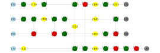
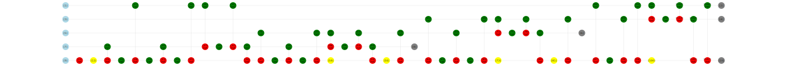

# Examples

Here we will show some examples of using `ZXCalculus.jl`.

## Clifford simplification

This example can be found in the appendix of [Clifford simplification](https://arxiv.org/abs/1902.03178). Firstly, we build up the circuit by using [`push_gate!`](@ref).

```julia
using ZXCalculus

function generate_example_1()
    zxd = ZXDiagram(4)
    push_gate!(zxd, Val(:Z), 1, 3//2)
    push_gate!(zxd, Val(:H), 1)
    push_gate!(zxd, Val(:Z), 1, 1//2)
    push_gate!(zxd, Val(:H), 4)
    push_gate!(zxd, Val(:CZ), 4, 1)
    push_gate!(zxd, Val(:CNOT), 1, 4)
    push_gate!(zxd, Val(:H), 1)
    push_gate!(zxd, Val(:H), 4)
    push_gate!(zxd, Val(:Z), 1, 1//4)
    push_gate!(zxd, Val(:Z), 4, 3//2)
    push_gate!(zxd, Val(:X), 4, 1//1)
    push_gate!(zxd, Val(:H), 1)
    push_gate!(zxd, Val(:Z), 4, 1//2)
    push_gate!(zxd, Val(:X), 4, 1//1)
    push_gate!(zxd, Val(:Z), 2, 1//2)
    push_gate!(zxd, Val(:CNOT), 3, 2)
    push_gate!(zxd, Val(:H), 2)
    push_gate!(zxd, Val(:CNOT), 3, 2)
    push_gate!(zxd, Val(:Z), 2, 1//4)
    push_gate!(zxd, Val(:Z), 3, 1//2)
    push_gate!(zxd, Val(:H), 2)
    push_gate!(zxd, Val(:H), 3)
    push_gate!(zxd, Val(:Z), 3, 1//2)
    push_gate!(zxd, Val(:CNOT), 3, 2)

    return zxd
end
ex1 = generate_example_1()
```
We can draw this ZX-diagram by using
```julia
using YaoPlots
plot(ex1)
```

To simplify `zxd`, one can simply use
```julia
simplified_ex1 = clifford_simplification(ex1)
```
or explicitly use
```julia
zxg = ZXGraph(ex1)
simplify!(Rule{:lc}(), zxg)
simplify!(Rule{:p1}(), zxg)
replace!(Rule{:pab}(), zxg)
simplified_ex1 = circuit_extraction(zxg)
```
And we draw the simplified circuit.
```julia
plot(simplified_ex1)
```


## Phase teleportation

This example is an arithmetic circuit from [phase teleportation](https://arxiv.org/abs/1903.10477).
We first build up the circuit.
```julia
using ZXCalculus, YaoPlots
function generate_example2()
    cir = ZXDiagram(5)
    push_gate!(cir, Val(:X), 5, 1//1)
    push_gate!(cir, Val(:H), 5)
    push_gate!(cir, Val(:Z), 5)
    push_gate!(cir, Val(:CNOT), 5, 4)
    push_gate!(cir, Val(:Z), 5, 7//4)
    push_gate!(cir, Val(:CNOT), 5, 1)
    push_gate!(cir, Val(:Z), 5, 1//4)
    push_gate!(cir, Val(:CNOT), 5, 4)
    push_gate!(cir, Val(:Z), 4, 1//4)
    push_gate!(cir, Val(:Z), 5, 7//4)
    push_gate!(cir, Val(:CNOT), 5, 1)
    push_gate!(cir, Val(:CNOT), 4, 1)
    push_gate!(cir, Val(:Z), 5, 1//4)
    push_gate!(cir, Val(:Z), 1, 1//4)
    push_gate!(cir, Val(:Z), 4, 7//4)
    push_gate!(cir, Val(:CNOT), 4, 1)
    push_gate!(cir, Val(:CNOT), 5, 4)
    push_gate!(cir, Val(:Z), 5, 7//4)
    push_gate!(cir, Val(:CNOT), 5, 3)
    push_gate!(cir, Val(:Z), 5, 1//4)
    push_gate!(cir, Val(:CNOT), 5, 4)
    push_gate!(cir, Val(:Z), 4, 1//4)
    push_gate!(cir, Val(:Z), 5, 7//4)
    push_gate!(cir, Val(:CNOT), 5, 3)
    push_gate!(cir, Val(:CNOT), 4, 3)
    push_gate!(cir, Val(:Z), 5, 1//4)
    push_gate!(cir, Val(:Z), 3, 1//4)
    push_gate!(cir, Val(:Z), 4, 7//4)
    push_gate!(cir, Val(:H), 5)
    push_gate!(cir, Val(:Z), 5)
    push_gate!(cir, Val(:CNOT), 4, 3)
    push_gate!(cir, Val(:CNOT), 5, 4)
    push_gate!(cir, Val(:H), 5)
    push_gate!(cir, Val(:Z), 5)
    push_gate!(cir, Val(:CNOT), 5, 3)
    push_gate!(cir, Val(:Z), 5, 7//4)
    push_gate!(cir, Val(:CNOT), 5, 2)
    push_gate!(cir, Val(:Z), 5, 1//4)
    push_gate!(cir, Val(:CNOT), 5, 3)
    push_gate!(cir, Val(:Z), 3, 1//4)
    push_gate!(cir, Val(:Z), 5, 7//4)
    push_gate!(cir, Val(:CNOT), 5, 2)
    push_gate!(cir, Val(:CNOT), 3, 2)
    push_gate!(cir, Val(:Z), 5, 1//4)
    push_gate!(cir, Val(:H), 5)
    push_gate!(cir, Val(:Z), 2, 1//4)
    push_gate!(cir, Val(:Z), 3, 7//4)
    push_gate!(cir, Val(:Z), 5)
    push_gate!(cir, Val(:CNOT), 3, 2)
    push_gate!(cir, Val(:CNOT), 5, 3)
    push_gate!(cir, Val(:H), 5)
    push_gate!(cir, Val(:Z), 5)
    push_gate!(cir, Val(:CNOT), 5, 2)
    push_gate!(cir, Val(:Z), 5, 7//4)
    push_gate!(cir, Val(:CNOT), 5, 1)
    push_gate!(cir, Val(:Z), 5, 1//4)
    push_gate!(cir, Val(:CNOT), 5, 2)
    push_gate!(cir, Val(:Z), 2, 1//4)
    push_gate!(cir, Val(:Z), 5, 7//4)
    push_gate!(cir, Val(:CNOT), 5, 1)
    push_gate!(cir, Val(:CNOT), 2, 1)
    push_gate!(cir, Val(:Z), 5, 1//4)
    push_gate!(cir, Val(:Z), 1, 1//4)
    push_gate!(cir, Val(:Z), 2, 7//4)
    push_gate!(cir, Val(:H), 5)
    push_gate!(cir, Val(:Z), 5)
    push_gate!(cir, Val(:CNOT), 2, 1)
    push_gate!(cir, Val(:CNOT), 5, 2)
    push_gate!(cir, Val(:CNOT), 5, 1)
    return cir
end
ex2 = generate_example2()
plot(ex2)
```


We can use [`phase_teleportation`](@ref) for reducing the number of T gates of a circuit without changing its general structure.
```julia
reduced_ex2 = phase_teleportation(ex2)
plot(reduced_ex2)
```


By using [`tcount`](@ref),
```julia
tcount(ex2)
tcount(reduced_ex2)
```
we can see that the number of T gates has decreased from 28 to 8.


## Other usages

In the previous sections, we introduced how to use `ZXCalculus.jl` for ZX-diagrams which represent quantum circuits. Sometimes, one may wish to use it for general ZX-diagrams. It is possible.

One can create a `ZXDiagram` by building up its `Multigraph` and other information. For example,
```julia
using ZXCalculus, YaoPlots, Graphs
g = Multigraph(6)
add_edge!(g, 1, 2)
add_edge!(g, 2, 3)
add_edge!(g, 3, 4)
add_edge!(g, 3, 5)
add_edge!(g, 3, 6)
ps = [0, 1, 1//2, 0, 0, 0]
v_t = [SpiderType.In, SpiderType.X, SpiderType.Z, SpiderType.Out, SpiderType.Out, SpiderType.Out]
zxd = ZXDiagram(g, v_t, ps)
```
Because the information of vertices locations of a general ZX-diagram is not provided, its plot will have a random layout.

We can manipulate `zxd` by using ZX-calculus [`Rule`](@ref)s.
```julia
matches = match(Rule{:pi}(), zxd)
rewrite!(Rule{:pi}(), zxd, matches)
```
